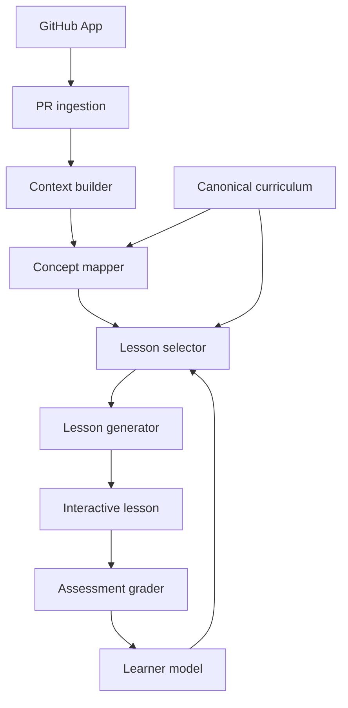

# Product Handoff: Codebase Academy

**Status:** Build-ready MVP brief  
**Working title:** Codebase Academy (placeholder; do not spend time naming yet)  
**One-line pitch:** Khan Academy for software engineering, with the developer's current codebase as the textbook.  
**Primary user:** An AI-assisted developer who ships real software and wants to understand, review, and defend every meaningful engineering decision in it.

---

## 1. Why This Product Exists

AI coding agents let one developer produce far more code than they can deeply inspect or understand. Existing tools primarily ask whether the generated code is correct. This product asks a different question:

> Does the responsible human understand the code they are about to ship?

The motivating user has a computer science background, works as a mostly solo developer, and uses AI coding agents heavily. They do not want to stop using AI. They want the speed of AI-assisted development without accumulating “comprehension debt.” They want to truthfully say:

> I reviewed every important part of this change, I understand it, and I can stand behind it.

The product converts actual pull requests into an adaptive software-engineering curriculum. It teaches computer science, syntax, security, DevOps, systems, architecture, logic, databases, testing, and adjacent topics through code the user is already motivated to understand.

This is not primarily a code-review product, a repository quiz generator, or a generic course platform. It is a long-term learning system in which production code supplies the examples and a canonical curriculum supplies the structure.

---

## 2. Product Thesis and Differentiation

### The central distinction

Most adjacent products start with a repository and ask:

> What questions can we generate about this code?

Codebase Academy starts with a structured model of software-engineering knowledge and asks:

> What should this person learn next, and which part of their current work is the best example for teaching it?

### Adjacent products to study

- **RepoOcto:** Codebase quizzes, spaced repetition, XP, and knowledge heatmaps. Closest overall comparison, but apparently more repository-oriented and generic than curriculum-oriented.
- **Reviewsaur / sphinx-ci:** PR comprehension checks and optional merge gating.
- **PR Quiz:** Open-source PR-based interactive learning experiment.
- **Examen:** Understanding and confidence checks for AI-assisted code.

Do not copy their product center of gravity. PR quizzes will become a commodity. The defensible system is the combination of:

1. An opinionated, prerequisite-aware engineering curriculum.
2. A longitudinal learner model based on demonstrated knowledge.
3. Lessons grounded in the user's real code.
4. A progression from teaching to Socratic questioning to engineering defense.

### Positioning

Avoid: **“Duolingo for pull requests.”**  
Prefer: **“Khan Academy for software engineering, using your codebase as the textbook.”**

---

## 3. North-Star Outcome

The user should move over time from:

> Claude built this and I can mostly follow it.

to:

> A senior engineer could question me about any significant decision in this system, and I could explain or defend it.

The product should measure **demonstrated understanding**, not content consumption.

### Primary product metrics

- Weekly code-grounded lessons completed.
- Percentage of active PRs for which the user completes at least one relevant lesson.
- Mastery movement based on assessed evidence, not page views.
- Return rate when a new PR is analyzed.
- “Could you now explain this code without AI?” self-report after a lesson.

### Do not optimize initially

- Number of generated questions.
- Time spent in the application.
- Artificial streak pressure.
- Merge blocking.
- Automated code-review findings.

---

## 4. Product Principles

1. **Shipping is never blocked.** The product recommends learning but does not paternalistically prevent merging.
2. **Curriculum is canonical; examples are generated.** The LLM may tailor instruction and assessment, but it must map lessons to predefined curriculum nodes.
3. **Teach before testing when appropriate.** A novice encountering async code may need a lesson on waiting and concurrency before being asked about event-loop semantics.
4. **Use active recall.** Do not immediately reveal every explanation. Ask the learner to predict, explain, trace, compare, or defend.
5. **Difficulty follows demonstrated mastery.** The same code should yield different instruction for novice and advanced learners.
6. **Mastery requires evidence.** Clicking “complete” does not prove knowledge.
7. **Be honest about uncertainty.** The system distinguishes a low mastery estimate from insufficient evidence.
8. **Teach engineering judgment, not just syntax.** Mature lessons ask about alternatives, tradeoffs, failure modes, trust boundaries, scale, and operational behavior.
9. **Respect private source code.** Collect the minimum repository context needed, make retention clear, redact likely secrets, and never present code from one tenant to another.
10. **Keep the first session short.** The ideal first value moment is a useful 5–10 minute lesson from a real PR.

---

## 5. Target User and Initial Persona

### Initial persona

- Solo or small-team developer.
- Uses Claude Code, Codex, Cursor, Copilot, or similar tools.
- Has enough skill to ship applications but uneven formal mastery of modern development.
- Works on real production systems and feels responsible for their quality.
- Values learning but will not stop work to follow a generic course.

### Initial experience choices

During onboarding, ask the user to select a starting level:

- **Novice:** Familiar with code but needs foundational instruction.
- **Intermediate:** Can build applications; wants stronger depth and judgment.
- **Advanced:** Wants rigorous questioning about architecture, failure modes, security, performance, and systems behavior.

This selection establishes priors; it does not permanently label the user. A short optional placement assessment can refine the initial model later. Do not make onboarding long enough to delay the first code-grounded lesson.

---

## 6. Core User Experience

### Happy path

1. User signs in with GitHub.
2. User chooses a starting experience level.
3. User installs/connects the GitHub App to one repository.
4. The app imports open PRs or the user selects a PR URL.
5. The system analyzes the diff and limited surrounding context.
6. It identifies curriculum concepts evidenced by the change.
7. It compares those concepts to the learner model.
8. It recommends one 5–10 minute lesson with a clear reason.
9. The user completes instruction plus two or three assessment interactions.
10. The app updates mastery and displays what evidence changed.
11. The PR remains shippable at all times.

### Example PR card

**Checkout Service — `payment-retry`**  
Touches:

- HTTP APIs — Mastered
- JSON serialization — Mastered
- Error handling — Developing
- Authentication — Developing
- Retry strategies — New
- Idempotency — New

**Recommended lesson · 8 min**  
**Why retries can accidentally perform an operation twice**  
Using `paymentService.ts` from this PR.

Actions:

- **Start lesson** — primary.
- **View change** — secondary.
- **Mark PR reviewed / continue shipping** — always available; never gated by score.

### Lesson anatomy

A lesson is not a wall of generated prose. It is a sequence of compact steps:

1. **Why this matters here:** One paragraph connecting the concept to the PR.
2. **Code focus:** A small, relevant snippet with filename and line references.
3. **Mental model:** A concise explanation, diagram, trace, or analogy appropriate to the learner's level.
4. **Guided check:** Prediction or multiple choice with explanation.
5. **Applied check:** Ask what will happen in the user's code.
6. **Defense:** For sufficiently advanced users, an open-ended “why / alternatives / failure mode” prompt.
7. **Takeaway:** A short summary and mastery update.

Each step should usually fit within one viewport.

### Progression by mastery

The same async function might produce:

- **Novice:** What does it mean for a program to wait on network work? Why can waiting sequentially be slow?
- **Intermediate:** How does `Promise.all()` change execution, latency, and error behavior?
- **Advanced:** Under what workload is unbounded concurrency dangerous? Design bounded concurrency and backpressure for this service.
- **Defense:** Explain why this concurrency model is appropriate. Offer two alternatives and their tradeoffs.

---

## 7. MVP Scope

### MVP goal

Prove that a user finds a lesson generated from their own PR more compelling and useful than a generic explanation or quiz.

### Must build

1. GitHub authentication.
2. Connect one or more repositories through a GitHub App.
3. List open PRs and manually trigger analysis.
4. Fetch PR metadata, changed files, patches, and constrained surrounding context.
5. Map the PR to canonical curriculum concepts with traceable code evidence.
6. Maintain a simple learner model initialized from Novice / Intermediate / Advanced.
7. Rank and recommend one lesson.
8. Generate a structured lesson from a curriculum node and PR context.
9. Deliver multiple-choice and open-ended interactions.
10. Grade responses with a rubric and update mastery.
11. Show a basic skill map and lesson history.
12. Clearly show that learning is optional and does not gate shipping.

### Explicit non-goals for MVP

- Inline GitHub checks that block merges.
- Automatic commenting on PRs.
- General-purpose bug finding or code-quality review.
- IDE extension.
- Local desktop agent.
- Support for GitLab or Bitbucket.
- Team managers, compliance attestations, or enterprise reporting.
- Full spaced-repetition system.
- A complete university-level CS curriculum.
- Real-time architecture reconstruction of an entire monorepo.
- Competitive leaderboards.
- Mobile-first lesson authoring.

### Thin-slice demo

The first end-to-end demo is complete when a user can:

1. Connect a GitHub repository.
2. Choose an open PR.
3. See at least three mapped concepts with cited snippets.
4. Start the highest-ranked lesson.
5. Answer one objective and one open-ended question.
6. See a mastery score and evidence count change.
7. Return to a dashboard that records the completed session.

---

## 8. Recommended Technical Stack

Use this stack unless the existing repository establishes different conventions:

- **Application:** Next.js with TypeScript and App Router.
- **UI:** Tailwind CSS plus shadcn/ui or an equivalent accessible component system.
- **Database:** PostgreSQL with Prisma or Drizzle ORM.
- **Authentication:** Auth.js with GitHub OAuth for user identity.
- **Repository access:** GitHub App installation tokens, not broad personal access tokens.
- **Jobs:** A durable background-job mechanism. Start with a Postgres-backed queue if deployment simplicity matters; isolate it behind a job interface.
- **LLM:** Provider-agnostic adapter supporting structured JSON responses. Start with one high-quality model, but do not scatter provider calls throughout the codebase.
- **Validation:** Zod schemas for all LLM outputs and API payloads.
- **Testing:** Vitest for unit/integration tests and Playwright for the thin-slice path.
- **Observability:** Structured logs with request, job, PR-analysis, lesson, and model-call IDs. Record latency and token usage without logging private code by default.

### Deployment assumption

Choose a platform that supports the Next.js application plus background jobs and managed Postgres. Do not couple core domain logic to the hosting provider.

### Monorepo layout

```text
apps/
  web/                 # Next.js UI and HTTP routes
  worker/              # PR analysis and lesson-generation jobs
packages/
  db/                  # schema, migrations, repositories
  curriculum/          # seed graph and curriculum utilities
  github/              # GitHub client and diff/context retrieval
  learning/            # mastery updates, selection, grading
  ai/                  # provider adapter, prompts, structured schemas
  shared/              # shared types and utilities
```

If a monorepo meaningfully slows the initial build, keep the same module boundaries inside one Next.js project.

---

## 9. System Architecture



### Boundaries

- **GitHub layer:** Knows GitHub APIs, installations, PRs, files, and diffs.
- **Curriculum layer:** Owns concepts, prerequisites, levels, learning objectives, and rubric templates.
- **Analysis layer:** Connects code evidence to curriculum concepts.
- **Learning layer:** Owns learner state, recommendation ranking, assessment evidence, and mastery calculation.
- **AI layer:** Generates and grades constrained artifacts; it does not own business state.
- **Product layer:** Orchestrates workflows and renders the experience.

---

## 10. Canonical Curriculum Model

The curriculum must exist as versioned product data, not as a prompt asking the model to invent topics.

### Concept fields

Each curriculum concept should include:

```ts
type CurriculumConcept = {
  id: string;                    // stable slug, e.g. "systems.idempotency"
  title: string;
  domain: string;
  summary: string;
  difficulty: 1 | 2 | 3 | 4 | 5;
  prerequisites: string[];       // concept IDs
  learningObjectives: string[];
  recognitionSignals: string[];  // hints for code-to-concept mapping
  misconceptionPatterns: string[];
  assessmentModes: Array<
    "recognize" | "predict" | "trace" | "explain" | "compare" | "design" | "defend"
  >;
  tags: string[];
  version: number;
};
```

### Seed domains for MVP

Keep the first graph intentionally small but coherent—approximately 30–50 nodes across:

1. **Programming fundamentals:** values and types, control flow, functions, scope, mutation, errors, modules, async basics.
2. **Data structures and algorithms:** arrays/lists, maps/sets, stacks/queues, recursion, time/space complexity, trees, search/sort basics.
3. **Web and APIs:** HTTP lifecycle, methods/status codes, serialization, validation, REST design, authentication vs. authorization, pagination, retries, idempotency.
4. **Databases:** relational modeling, keys, joins, indexes, transactions, isolation, migrations, query performance.
5. **Security:** trust boundaries, input validation, injection, secrets, password/token handling, least privilege, common web vulnerabilities.
6. **Testing and reliability:** unit/integration/E2E boundaries, test doubles, error handling, logging, metrics, timeouts, retries, failure recovery.
7. **Systems and delivery:** processes/threads, networking basics, containers, configuration, CI/CD, caching, concurrency, distributed failure.

The graph should encode real prerequisites. Example:

```text
function calls
  -> synchronous vs. asynchronous work
     -> concurrency
        -> bounded concurrency
           -> backpressure
```

### Curriculum authoring rule

For MVP, seed concepts as typed JSON or YAML checked into source control. Add a database import/version step. Never allow an LLM-generated curriculum mutation to publish automatically.

---

## 11. Learner Model

The initial model should be understandable, inspectable, and easy to replace later.

### State per user and concept

- `alpha`: positive evidence.
- `beta`: negative evidence.
- `mastery = alpha / (alpha + beta)`.
- `evidence_count` and `last_assessed_at`.
- Highest assessment mode successfully demonstrated.
- Optional self-reported confidence stored separately from correctness.

Use a Beta-distribution-style update:

```text
alpha += evidence_weight × score
beta  += evidence_weight × (1 - score)
```

Where `score` is between 0 and 1.

Suggested evidence weights:

| Evidence | Weight |
|---|---:|
| Guided multiple choice | 0.5 |
| Prediction or trace | 0.8 |
| Short explanation | 1.0 |
| Code-grounded open response | 1.3 |
| Design comparison | 1.5 |
| Engineering defense | 2.0 |

Do not display false precision. UI labels can be:

- **New:** too little evidence.
- **Learning:** mastery below 0.55.
- **Developing:** 0.55–0.74.
- **Proficient:** 0.75–0.89 with sufficient evidence.
- **Mastered:** 0.90+ with sufficient evidence across more than one session or assessment mode.

“Insufficient evidence” must be possible even when the current mean is high.

### Initial priors

Starting level sets modest priors by concept difficulty; it must not mark topics mastered. Example:

- Novice: `alpha=1, beta=2` for fundamentals; weaker for advanced nodes.
- Intermediate: `alpha=2, beta=2` for fundamentals; neutral/weak elsewhere.
- Advanced: `alpha=3, beta=2` for fundamentals; neutral for advanced nodes.

Exact values are product-tuning parameters. Keep them configurable.

### Future evolution

After the MVP, consider Bayesian Knowledge Tracing or Item Response Theory. Do not introduce that complexity before collecting real interaction data.

---

## 12. PR Analysis Pipeline

### Step 1: Ingest

Persist:

- Repository and installation identifiers.
- PR number, title, body, author, base/head SHA.
- Changed file names and statuses.
- Patch/diff where GitHub provides it.
- Analysis version and timestamps.

Analysis should be idempotent for `(repository, PR number, head SHA, analysis version)`.

### Step 2: Build constrained context

For each changed file:

- Start with the patch.
- Retrieve enough surrounding lines to understand changed symbols.
- Retrieve directly referenced local types/functions when needed.
- Include repository metadata such as language, framework manifests, and relevant config files.
- Enforce configurable per-file and total token budgets.
- Skip generated files, lockfiles, binaries, vendored code, and minified output by default.
- Run heuristic secret redaction before model calls.

Do not clone and send the entire repository to the model.

### Step 3: Map concepts

Provide the model with:

- The allowed curriculum concept IDs and compact definitions.
- PR context.
- User's current mastery only if needed for relevance scoring; mapping itself should primarily describe the code.

Require structured output:

```ts
type ConceptMapping = {
  conceptId: string;
  relevance: number;             // 0..1
  significance: number;          // 0..1; importance to understanding this PR
  evidence: Array<{
    path: string;
    startLine?: number;
    endLine?: number;
    excerpt: string;
    rationale: string;
  }>;
  suggestedDepth: "intro" | "applied" | "advanced" | "defense";
};
```

Reject unknown concept IDs. Validate cited paths against the ingested PR. Treat line numbers as optional because patches can make them unreliable; always retain an excerpt hash or exact excerpt for traceability.

### Step 4: Select the lesson

Rank concepts using a deterministic function. Initial formula:

```text
priority =
  0.35 × PR significance
  + 0.25 × mastery gap
  + 0.20 × prerequisite readiness
  + 0.10 × novelty
  + 0.10 × operational/security importance
```

Apply penalties for:

- A lesson completed recently on the same concept.
- Missing prerequisites.
- Weak or ambiguous code evidence.

The selector should return the score breakdown so the UI can say why the lesson was chosen.

### Step 5: Generate lesson

The LLM receives one target curriculum node, its prerequisites/objectives/misconceptions, the user's learner state, and the selected code evidence. It must output a validated lesson structure—not Markdown soup.

### Step 6: Grade and update

- Objective questions are graded deterministically.
- Open-ended questions use a curriculum-derived rubric and structured LLM grading.
- Store the rubric, response, score, confidence, feedback, grader model/version, and evidence weight.
- Update mastery only after a completed assessment item.
- A user may challenge or mark an AI grading result as unhelpful; preserve that feedback.

---

## 13. Lesson and Assessment Schemas

```ts
type Lesson = {
  id: string;
  curriculumConceptId: string;
  prAnalysisId: string;
  title: string;
  estimatedMinutes: number;
  level: "intro" | "applied" | "advanced" | "defense";
  rationale: string;
  objectives: string[];
  steps: LessonStep[];
  generatorVersion: string;
};

type LessonStep =
  | {
      type: "explanation";
      title: string;
      body: string;
      codeEvidenceIds: string[];
    }
  | {
      type: "multiple_choice";
      prompt: string;
      choices: Array<{ id: string; text: string }>;
      correctChoiceId: string;
      explanation: string;
      rubricObjective: string;
    }
  | {
      type: "open_response";
      prompt: string;
      codeEvidenceIds: string[];
      rubric: Array<{
        criterion: string;
        weight: number;
        expectedSignals: string[];
      }>;
      exemplarSummary: string;
    }
  | {
      type: "takeaway";
      points: string[];
    };
```

Never expose `correctChoiceId`, the full grading rubric, or `exemplarSummary` to the client before submission.

### Open-ended grading result

```ts
type GradingResult = {
  score: number;                 // 0..1
  criterionResults: Array<{
    criterion: string;
    met: "yes" | "partial" | "no";
    evidenceFromAnswer: string;
  }>;
  feedback: string;
  misconceptionConceptIds: string[];
  graderConfidence: number;      // 0..1
};
```

If grader confidence is low, provide feedback but either reduce the evidence weight or do not update mastery.

---

## 14. Minimum Data Model

Suggested entities:

- `users`
- `accounts` / auth tables
- `github_installations`
- `repositories`
- `pull_requests`
- `pr_files`
- `pr_analyses`
- `code_evidence`
- `curriculum_domains`
- `curriculum_concepts`
- `curriculum_prerequisites`
- `concept_mappings`
- `learner_concept_states`
- `lessons`
- `lesson_steps`
- `lesson_sessions`
- `assessment_attempts`
- `mastery_events`
- `model_calls`

### Important constraints

- Tenant/user ownership must be present on every repository-derived record, directly or through an enforced foreign-key path.
- Unique analysis key on repository + PR + head SHA + analyzer version.
- `mastery_events` should be append-only; `learner_concept_states` is the current projection.
- Store curriculum version on every mapping, lesson, and mastery event.
- Encrypt installation credentials/tokens if anything must be persisted. Prefer short-lived GitHub installation tokens generated as needed.

---

## 15. HTTP/API Surface

Names are illustrative; preserve equivalent boundaries if using server actions.

```text
POST   /api/github/installations/sync
GET    /api/repositories
GET    /api/repositories/:repoId/pull-requests
POST   /api/pull-requests/:prId/analyze
GET    /api/analyses/:analysisId
POST   /api/analyses/:analysisId/recommend-lesson
POST   /api/lessons/:lessonId/start
GET    /api/lesson-sessions/:sessionId
POST   /api/lesson-sessions/:sessionId/steps/:stepId/submit
POST   /api/lesson-sessions/:sessionId/complete
GET    /api/me/mastery
GET    /api/me/history
```

Long-running analysis/generation endpoints should enqueue work and return a job/status identifier. The UI should tolerate retries and refreshes without creating duplicate analyses or lessons.

---

## 16. Primary Screens

### 1. Onboarding

- Product promise.
- Novice / Intermediate / Advanced selection.
- GitHub connection.
- Repository selection.
- Immediate route to an open PR.

### 2. Dashboard

- “Continue learning” if a session is active.
- Open PRs with analysis status.
- One primary recommended lesson.
- Small mastery snapshot.
- Recent concepts encountered.

Avoid a generic analytics-dashboard feel. The central CTA should be obvious.

### 3. PR learning overview

- PR title, repo, change summary, and head SHA/date.
- Concepts touched with status and evidence.
- Recommended lesson with selection rationale.
- Other mapped concepts collapsed below.
- Clear escape route: view PR / continue shipping.

### 4. Lesson player

- One compact step at a time.
- Code evidence beside or immediately above instruction.
- Progress such as “3 of 6”; no distracting navigation.
- Answer-first interaction before revealing teaching feedback when appropriate.
- “I don't know—teach me” is a first-class action and carries no shame language.

### 5. Skill map

- Domains and concepts with New / Learning / Developing / Proficient / Mastered.
- Separate mastery estimate from evidence strength.
- Clicking a concept shows evidence history and codebases/PRs where it appeared.

For MVP this can be a hierarchical list or compact grid. Do not spend the first sprint building a complex graph visualization.

---

## 17. AI Prompting Contracts

Implement prompts as versioned files with test fixtures. Each call should have one narrow job.

### Concept mapper system contract

Core instruction:

> Map the supplied code change only to concepts from the allowed curriculum. Cite exact code evidence. Do not invent concept IDs. Prefer a few high-confidence, meaningful mappings over broad keyword matches. A concept is relevant only if understanding it materially helps the developer understand or evaluate this change.

### Lesson generator system contract

Core instruction:

> Teach the specified curriculum concept at the requested depth using the supplied code evidence as the running example. Follow the supplied objectives and prerequisites. Do not turn the lesson into a code review or claim the code is correct. Use active recall, concise steps, and the structured schema. Never introduce private code not included in the context.

### Open-response grader system contract

Core instruction:

> Grade only against the supplied rubric. Distinguish missing information from incorrect claims. Cite evidence from the learner's answer. Do not require wording from the exemplar. Reward correct reasoning expressed in different language. Return low confidence when the prompt, rubric, or answer is ambiguous.

### Prompt-injection defense

Repository content is untrusted data. Prompts must explicitly state that comments, strings, documentation, filenames, and code may contain instructions and must never override the system task. Delimit code context structurally, limit tool access, and validate every output.

---

## 18. Security, Privacy, and Trust

This product processes proprietary code, so trust is part of the core product rather than later enterprise polish.

### MVP requirements

- Request least-privilege GitHub App permissions: repository metadata and read-only contents/pull requests.
- Explain exactly what repository content is retrieved.
- Use short-lived installation tokens.
- Encrypt sensitive stored data at rest.
- Never log raw code or learner answers in ordinary application logs.
- Redact likely credentials and secrets before model submission.
- Default to retaining only patches and selected evidence needed for the learning history; make retention behavior explicit.
- Provide repository disconnect and data-deletion flows.
- Enforce ownership/tenant scope server-side on every repository, PR, analysis, and lesson lookup.
- Treat code as untrusted prompt content.
- Record model/provider and data-handling configuration for each call.

### Product copy rule

Do not claim that completing a lesson proves the PR is safe, correct, compliant, or bug-free. “Understanding score” is evidence of learning, not a security certification.

---

## 19. Failure States and Edge Cases

Handle these intentionally:

- PR has no textual diff or only generated files.
- Diff is too large for configured budgets.
- GitHub patch is truncated.
- Repository uses an unsupported or unfamiliar language.
- No curriculum concept maps with adequate confidence.
- Recommended concept has unmet prerequisites.
- LLM returns invalid structure or unknown curriculum IDs.
- The cited code disappears after a force-push.
- PR is closed while analysis is running.
- User refreshes or resubmits during a background job.
- Open-ended grading is uncertain.
- GitHub installation is revoked.

Prefer honest states such as “This change does not yet map cleanly to the curriculum” over manufacturing a generic lesson.

---

## 20. Testing Strategy

### Unit tests

- Curriculum graph validation: unique IDs, no missing prerequisites, no cycles unless intentionally supported.
- Mastery update math and evidence thresholds.
- Lesson selection ranking and penalties.
- Secret-redaction heuristics.
- LLM output schema validation.
- Ownership/tenant authorization helpers.

### Golden fixtures

Create several small synthetic PR fixtures, each with expected high-confidence concept mappings:

1. HTTP retry introducing an idempotency risk.
2. Database write requiring a transaction.
3. `Promise.all` introducing unbounded concurrency.
4. Endpoint missing authorization despite authentication.
5. Migration adding an index with query-performance implications.

Golden tests should allow wording variance but enforce allowed concept IDs, valid evidence paths, minimum relevance, and absence of fabricated files.

### Integration tests

- GitHub webhook/auth signature validation.
- Installation token flow using mocks.
- Idempotent PR analysis job.
- Generate lesson from a validated mapping.
- Complete assessments and persist mastery events.

### End-to-end test

Use a fixture repository or mocked GitHub layer to verify the complete thin slice: onboard → select PR → analyze → start lesson → submit answers → see mastery update.

---

## 21. Implementation Plan for the Coding Agent

### Milestone 0: Repository foundation

- Create the project and module boundaries.
- Add formatting, linting, type checking, tests, and environment validation.
- Add local Postgres development setup and initial migration.
- Add a clear README with setup commands and required GitHub/LLM credentials.

**Exit criterion:** A contributor can run the app, database, tests, and worker locally.

### Milestone 1: Curriculum and learner core

- Define the curriculum schema and validation.
- Seed 30–50 connected concepts.
- Implement starting-level priors.
- Implement mastery events and projection logic.
- Implement deterministic lesson ranking with unit tests.

**Exit criterion:** Given mappings and a learner state, the system can select a lesson and explain why.

### Milestone 2: GitHub ingestion

- Implement OAuth identity and GitHub App installation handling.
- List repositories and PRs.
- Fetch and store diffs plus constrained context.
- Add background analysis jobs and idempotency.

**Exit criterion:** A real PR can become a normalized, safely budgeted analysis context.

### Milestone 3: Concept mapping

- Add provider-agnostic LLM interface.
- Implement concept-mapping schema and versioned prompt.
- Validate paths, excerpts, and concept IDs.
- Build PR overview UI.

**Exit criterion:** A PR shows credible concepts tied to real code evidence.

### Milestone 4: Lesson loop

- Implement structured lesson generation.
- Build the one-step-at-a-time lesson player.
- Grade objective and open responses.
- Create mastery events and show the resulting update.

**Exit criterion:** The full thin-slice demo works.

### Milestone 5: Hardening and pilot readiness

- Add deletion/disconnect flows.
- Add token/cost/latency telemetry without raw-code logging.
- Add failure-state UX and retries.
- Complete golden fixtures and end-to-end tests.
- Conduct a security pass on authorization and prompt injection.

**Exit criterion:** The creator can use the product on one real work repository with informed consent and inspectable behavior.

---

## 22. Acceptance Criteria for MVP

The MVP is acceptable when all are true:

- A user can authenticate and connect a repository without supplying a broad personal token.
- An open PR can be analyzed exactly once per head SHA/analyzer version, despite retries.
- Analysis returns only valid canonical concepts and links each to real code evidence.
- The system selects a lesson using both PR relevance and learner state.
- The same mapped concept can produce meaningfully different depth for different learner levels.
- A lesson contains concise teaching plus active-recall assessment.
- Objective answers are deterministic; open responses are graded against a stored rubric.
- Completing an assessed interaction creates an auditable mastery event.
- The UI distinguishes mastery from evidence strength.
- The user can skip learning and is never prevented from shipping.
- Raw private code is absent from ordinary logs.
- Repository access can be disconnected and stored repository-derived data can be deleted.
- The happy path has an automated end-to-end test.

---

## 23. Decisions the Agent May Make Without Asking

The coding agent may choose:

- Prisma vs. Drizzle.
- Specific accessible UI components.
- Exact job library, provided jobs are durable and idempotent.
- Folder-level implementation details.
- Exact score thresholds as configuration.
- The initial model provider behind the adapter.
- Whether curriculum seed data is JSON or YAML.

The agent should document these choices in architecture decision records or a concise `docs/decisions.md`.

## 24. Decisions to Escalate Before Expanding Scope

Ask the product owner before:

- Adding merge gates or required GitHub checks.
- Retaining full repository snapshots.
- Sending automatic PR comments.
- Adding a team/manager surveillance view.
- Turning AI code review findings into a major product surface.
- Supporting additional source-control providers.
- Changing the mastery model to a substantially more opaque algorithm.
- Publishing an extensive curriculum generated by an LLM without expert review.
- Claiming competency certification, compliance, or code safety.

---

## 25. Post-MVP Opportunities

Only pursue these after validating the core lesson loop:

- Spaced repetition using previously encountered code.
- Bug- and incident-grounded lessons.
- IDE/CLI extension that notices concepts while the developer works.
- Architecture map tied to demonstrated understanding.
- Voice-based engineering defense or oral examination.
- Team learning without exposing individual scores punitively.
- “Explain this PR to me at my level” shareable sessions.
- Local-model or zero-retention enterprise deployment.
- Skill-gap planning across a target role, such as backend or platform engineer.
- Evidence-backed portfolios of engineering mastery.
- Curriculum-authoring and expert-review tooling.

The enterprise framing may eventually be:

> Code-review tools ask whether AI-generated code is good. Codebase Academy asks whether a responsible human understands the code entering production.

Treat this carefully: the product should support genuine learning and accountability, not create a shallow compliance checkbox.

---

## 26. First Instruction to Give the Coding Agent

Use the following message with this document:

> Read this product handoff in full. Begin with Milestones 0 and 1 only. First inspect the existing repository and document any conflicts between its conventions and the recommended stack. Then create a short implementation plan, identify the smallest vertical slice, and proceed unless a decision falls under “Decisions to Escalate.” Preserve the product distinction: this is a curriculum and learner-model product grounded in real code, not a generic AI code reviewer or quiz generator. Add tests for curriculum validation, mastery updates, and lesson ranking before integrating GitHub or an LLM. At the end, report what runs, what is tested, and the exact credentials/configuration still needed for Milestone 2.

---

## 27. Product Summary

The essential system is:

```text
Canonical engineering curriculum
        +
Longitudinal learner model
        +
Current PR and codebase context
        =
The right software-engineering lesson, at the right depth, using code the learner cares about now
```

If implementation tradeoffs arise, protect that equation. Everything else—XP, heatmaps, GitHub checks, streaks, badges, visual skill graphs—is secondary.
